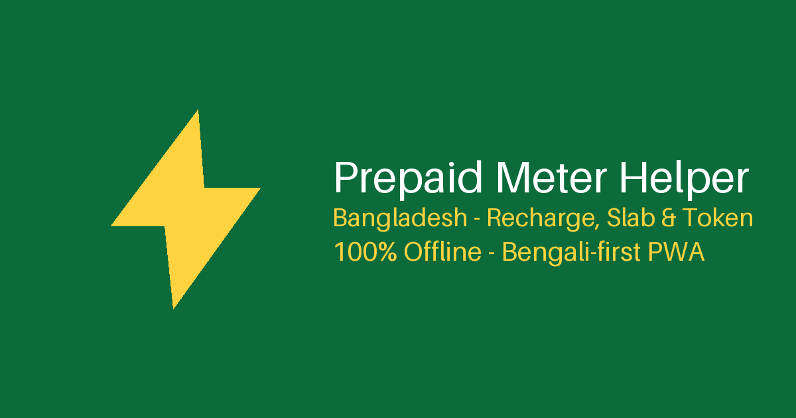

<p align="center">
  
</p>

<h1 align="center">Prepaid Meter Helper (প্রিপেইড মিটার সহায়ক)</h1>

<p align="center">
  <b>A Bengali-first, 100% offline helper for Bangladesh's prepaid electricity meter users.</b><br>
  Recharge breakdown • BERC slabs • Token check • Usage tracker — all in one place.<br>
  by <a href="https://github.com/tbahsan"><b>tbahsan</b></a>
</p>

<p align="center">
  <a href="https://tbahsan.github.io/utility-token-visualizer/"></a>
</p>

<p align="center">
  
  
  
  
  
  
  
</p>

<p align="center">
  <a href="README_BN.md">বাংলা README (canonical)</a>
</p>

---

## Features

| Tab | What you get |
|---|---|
| **Recharge** | Where does your ৳1000 go? Meter rent, demand charge, 5% VAT, 0.5% rebate — table + color bar + plain-language explanation + read-aloud |
| **Slabs** | BERC residential (LT-A) marginal slabs, step-by-step + average rate |
| **Token** | 20-digit validator, `XXXX-XXXX` formatter, meter-entry guide |
| **Usage tracker** | Reading log (device-only), month-end forecast, “balance lasts ≈ X days”, CSV export |
| **Appliances** | Monthly cost per appliance + “run the AC 2h less” what-if slider |
| **Gas & water** | Titas/WASA guides (full calculators on the roadmap) |

**For everyone:** Bengali-numeral input (১০০০), dark mode, print-friendly output, screen-reader support, installable PWA.

## Run

**Hosted (easiest):** https://tbahsan.github.io/utility-token-visualizer/

**Locally:**

```bash
git clone https://github.com/tbahsan/utility-token-visualizer.git
cd utility-token-visualizer
python3 -m http.server 8000
# → http://localhost:8000
```

> JSON won't load over `file://` — use any static server.

**Install on phone:** open the page in Chrome → *Add to Home Screen* — then it works without internet.

## Formula (fully transparent)

```
base   = recharge − arrears
VAT    = base − base/1.05        (5%, VAT-inclusive treatment)
rebate = 0.5% × base/1.05
energy = base/1.05 − rent − demand + rebate
```

- Demand Tk 42/kW • Rent: single-phase Tk 40 / three-phase Tk 250
- Slabs are **marginal (block-wise)** — never flat
- Lifeline Tk 4.63 applies **only** when total ≤ 50 units
- Tariffs: `tariffs/tariffs.json` (effective 2026-06-01, verified 2026-09-20)

Mismatch with your receipt? [Open an issue](https://github.com/tbahsan/utility-token-visualizer/issues) with a redacted receipt photo.

## File structure

```
utility-token-visualizer/
├── index.html            # App (Bengali-first)
├── manifest.json, sw.js  # PWA + offline
├── assets/css|js|icons/  # Styles, logic, icons
├── i18n/bn.json, en.json # Languages (bn canonical)
├── tariffs/tariffs.json  # Tariffs (community-updatable)
├── data/appliances.json  # Appliance defaults
└── .github/workflows/    # JSON + i18n + tariff CI
```

## Privacy

- **No server, no database, no tracking** — everything computes in your browser.
- Readings/settings live only in `localStorage`; wipe them in one click.
- Zero CDN dependency for core features — fully functional offline.

## Contribute

Tariff change? Just update `tariffs/tariffs.json` + the `last_verified` date — no coding needed. Details: [CONTRIBUTING_BN.md](CONTRIBUTING_BN.md).

---

## Author

<p align="center">
  <a href="https://github.com/tbahsan"></a>
</p>

<p align="center">
  <b>tbahsan</b><br>
  Building open-source, Bengali-first web tools — Dhaka, Bangladesh<br>
  <a href="https://github.com/tbahsan">github.com/tbahsan</a> •
  <a href="https://github.com/tbahsan?tab=repositories">More projects</a> •
  <a href="https://github.com/tbahsan/utility-token-visualizer/issues">Bugs / ideas</a>
</p>

<p align="center">
  <a href="https://github.com/tbahsan"></a>
  <a href="https://github.com/tbahsan/utility-token-visualizer"></a>
</p>

## Support

If this helped you, please ⭐ **Star** it and share with friends. Every star fuels the next project.

## License

**MIT © 2026 tbahsan** — see [LICENSE](LICENSE). Fork it, learn from it, improve it — just keep the original author's credit.

<p align="center"><sub>Made with care in Dhaka, Bangladesh • ঢাকায় যত্নে তৈরি</sub></p>
